# Doctor Appointment Booking portal, Technology Used  php, MySQL,Tailwind CSS,   
## Doctor Appointment booking portal Using PHP Mysql
edocs.sql file that is used for xampp server 
edocs_workbench.sql thst is used  for  MySQL workbench

## for without using xampp apache server use this command in terminal
php -S localhost:[port number]
eg.  php -S localhost:5000

### log in panel
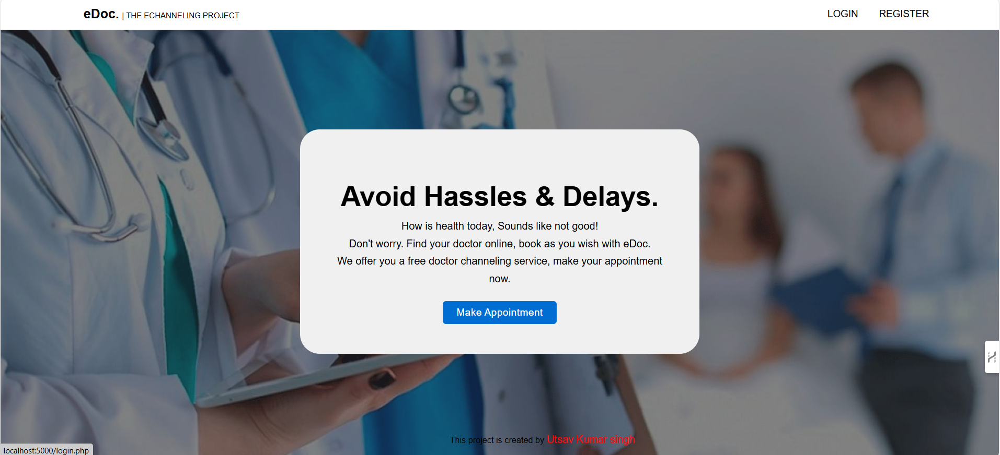
### Admin Panel
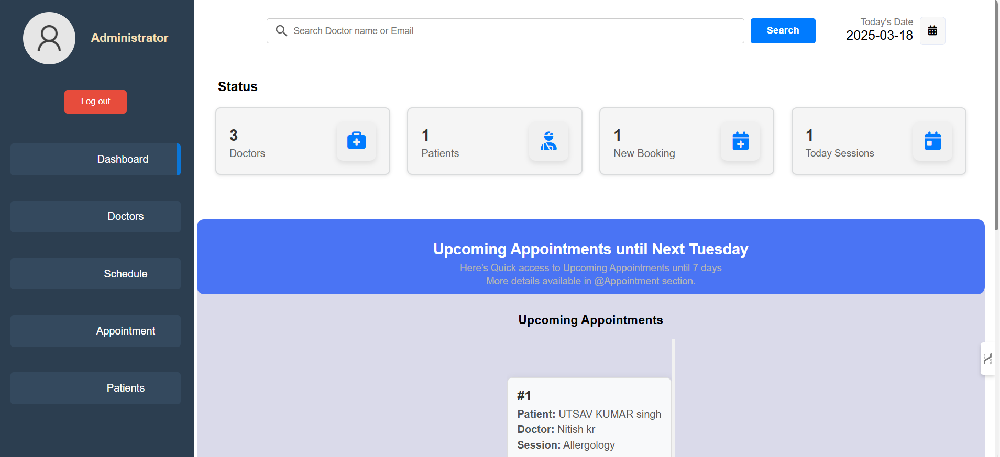
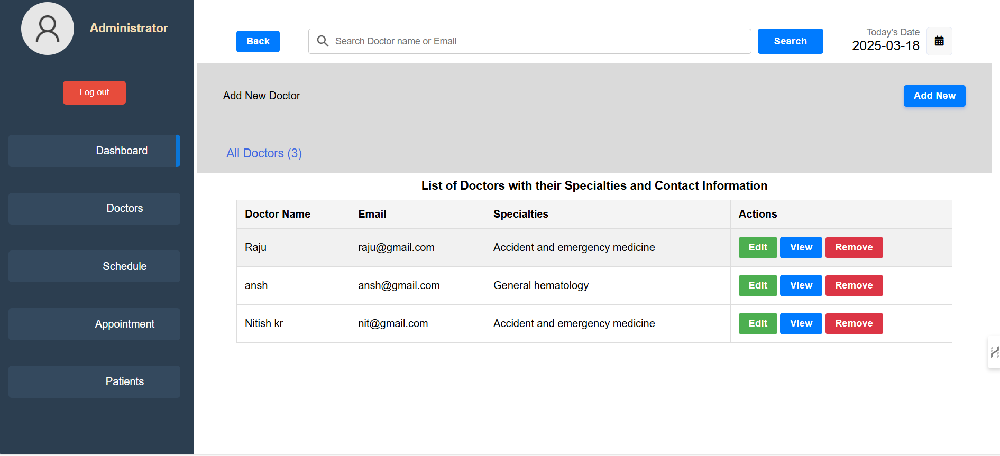
### Patient portal
 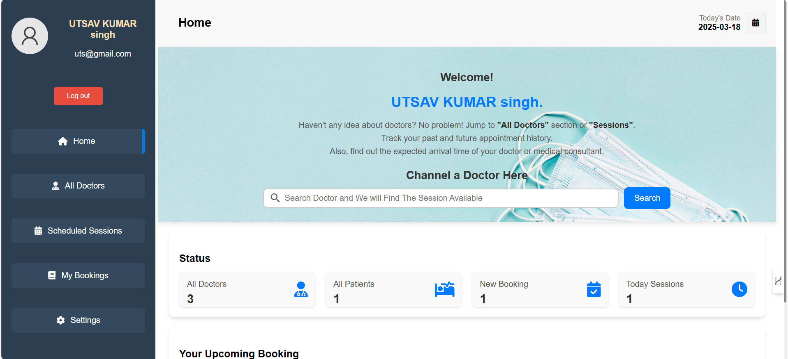
 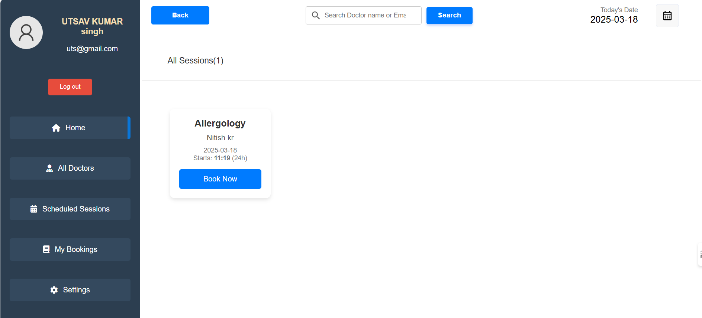
 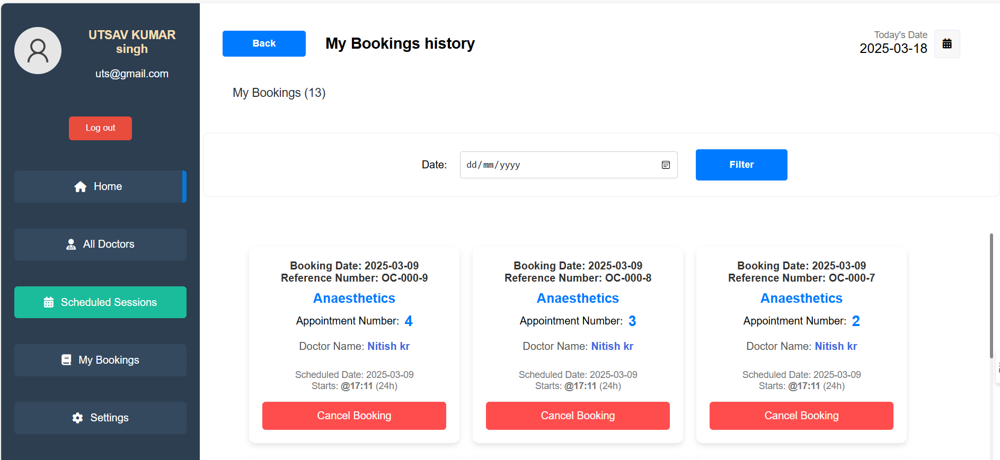
 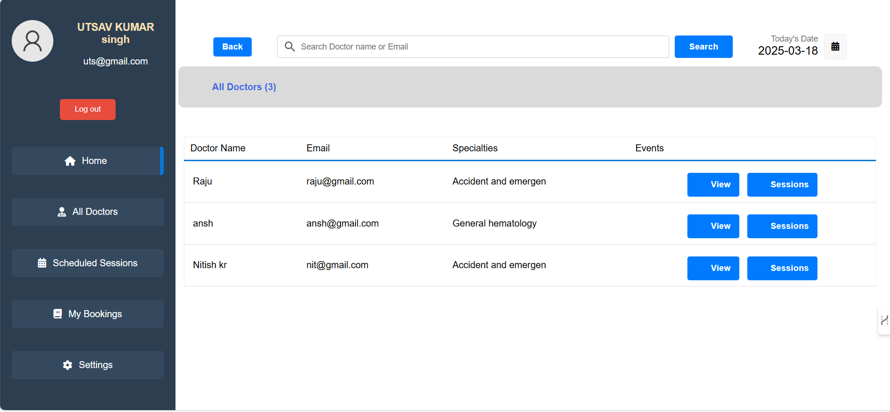
### doctor portal
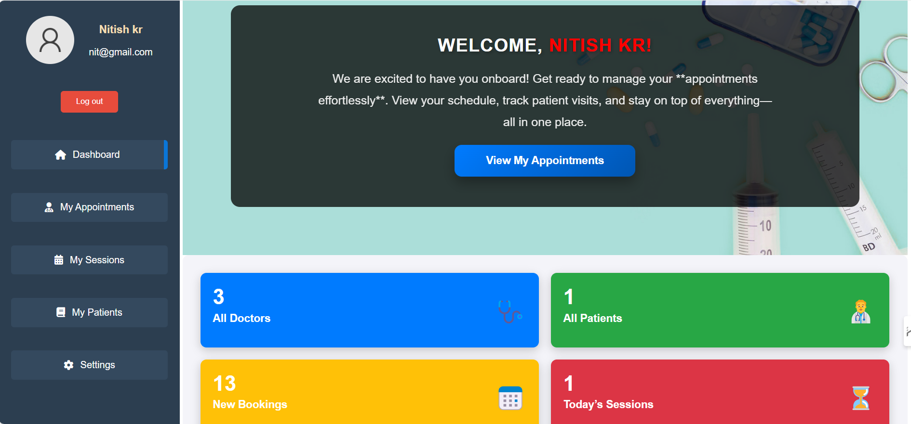
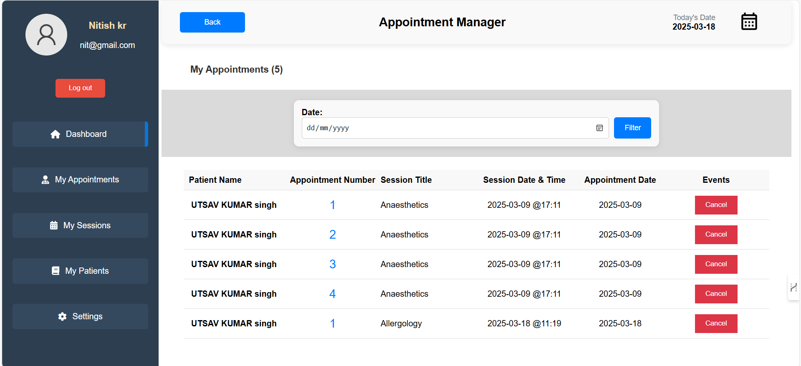
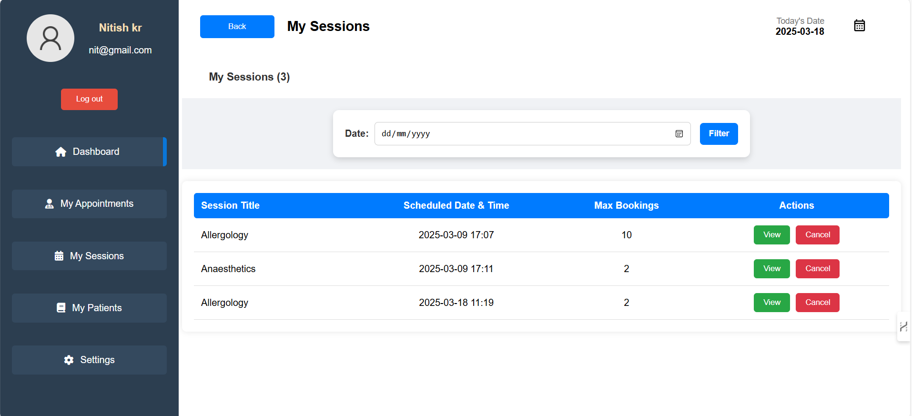
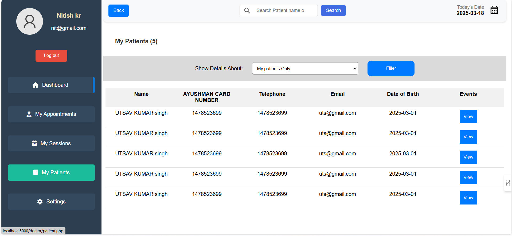